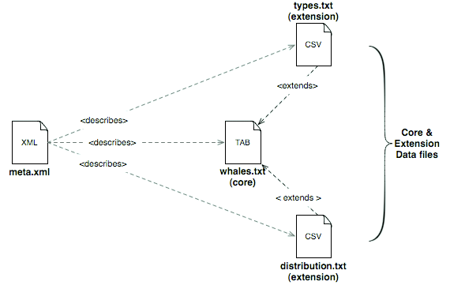

[back to landing page](README.md)

"You can write better software than this..."

# Converting a Darwin Core Archive to RDF

## What is a Darwin Core Archive (DwC-A)?

If you are asking this question, there is a high probability that you don't really need to be reading this page.  If you want to know about DwC-A (or already know), read on.

Darwin Core archives are used as an efficient way to transmit biodiversity data as fielded text documents (e.g. CSV files).  They are the most common way that natural history museums, herbaria, and citizen-science projects like eBird and iNaturalist send species occurrence records to the [Global Biodiversity Information Facility (GBIF)](http://www.gbif.org/), the international organization that aggregates biodiversity data from around the world. Darwin Core archives use the standardized vocabulary of [Darwin Core](http://rs.tdwg.org/dwc/terms/), an international metadata standard developed by [TDWG](http://www.tdwg.org/). For the details of how a Darwin Core archive is structured, see the [GBIF Darwin Core Archive How-to Guide](http://www.gbif.org/resource/80636).  

Diagram from the [Darwin Core Text Guide](http://rs.tdwg.org/dwc/terms/guides/text/)

A Darwin Core archive may consist of a single fielded text file consisting of records about a single kind of resource (e.g. occurrences), or several related (extension) text files that are linked to a core text file in a "star schema" pattern.  An XML formatted file (meta.xml) describes the relationships among the core and extension files, including the mapping of columns to Darwin Core properties.

## Guid-O-Matic's Darwin Core Archive translator

If you have already read [the description of how Guid-O-Matic maps CSV table columns to RDF properties and links several related CSV metadata files to a core CSV metadata file](use.md), you will recognize the similarity between the Guid-O-Matic structure and the structure of a Darwin Core archive.  

The Xquery script translate-meta.xq reads in data from a DwC-A meta.xml file and writes it to the various CSV files that are required to make Guid-O-Matic run.  After running the translation script, you can make additional edits to the generated CSV files in order to make the RDF conform to your favorite graph model and to provide appropriate datatypes and language tags for literals.  

## Running the DwC-A translator

Unlike the main Guid-O-Matic script, which is part of an Xquery module, the DwC-A translator is part of a regular Xquery query document.  So it can be run directly from the BaseX query window.  The file containing the query, translate-meta.xq, is in the dwc-a subfolder of the guid-o-matic folder.  That folder also includes a namespace abbreviation list in namespace.csv, which contains all of the namespaces that you are likely to need for the initial translation of the DwC-A archive.  You may need to add additional abbreviations as you map other properties to columns in the metadata tables.

The same issues of specifying file locations exist here as in Guid-O-Matic.  However, since the DwC-A program is just a hack, the file locations are hard-coded in the script in lines 34-36.  You will have to edit them to fit your circumstances. In theory, Mac users won't have to mess with $repoPath and $pcRepoLocation.  PC users will have to specify $pcRepoLocation as the path to wherever they cloned the Guid-O-Matic repo on their hard drive.  $localFilesFolderPC is the path to where the output files should be saved.  You should save them to wherever you plan to run Guid-O-Matic with them.  

The next thing you need is a Darwin Core Archive to play with.  There are two possibilities.  One is the ["practice" Molluscs of Andorra file](http://www.siba.ad/andorra/dwcaMolluscsAndorra.zip) that is referenced by GBIF in their How-To Guide.  This is probably the best one to start with because it is the simplest and has only a single core metadata text file.  A second file, gbif-bioimages.zip, is included in the repo in the dwc-a subfolder.  It contains two metadata files: the core file occurrences.csv and the multimedia extension file images.csv .  Unzip whichever archive you want to play with in the same folder as specified by $$repoPath.  

You should now be able to run the translation script (translate-meta.xq).  It will generate a constants.csv file, a linked-classes.csv file, and all [className]-classes.csv and [className]-column-mapping.csv files that are needed to run Guid-O-Matic.  NOTE: when you run the translator, it will overwrite without warning any existing files of the same names as the ones it generates.  So be careful if you've already spent a lot of time editing the mapping files during previous tests.

## Creating RDF by using Guid-O-Matic with the generated files

You can now try creating RDF serialization based on the data from the DwC-A archive.  You can run Guid-O-Matic from any location, but you'll need to specify the location of the dwc-a folder when you fill in the third parameter of the function in the test-serialize.xq file.  For example, change "guid-o-matic/" to "guid-o-matic/dwc-a/" if you left the files in their default locations.  If you are testing the Andorran Moluscs file, you can use "SIBA:Molluscs:40" as the first parameter.  If you are using the Bioimages data, you can use "http://bioimages.vanderbilt.edu/ind-baskauf/10262#2001-11-30" as the first parameter.

When you examine the output, you will notice that some things are missing.  For example, there is no value for dc:creator.  You can add it to the constants.csv file.  If you are using the mollusc archive, you also will need to make up some http:// domain (http://example.org/ would work) to use as the value in the domainRoot column of contants.csv .  Without this, the RDF serializations probably won't be valid.

One thing that you will notice is that the RDF graph is very simple.  In the mollusc data, all properties have the occurrence instance as their subject.  That's because the translator assumes that every column in the table applies to the root class.  In order to use some other graph model, such as [Darwin-SW](https://github.com/darwin-sw/dsw), you will have to modify the -classes.csv and -column-mapping.csv files. You can look at the sample tang-song data as an example of a more complex graph model.

[back to landing page](README.md)
